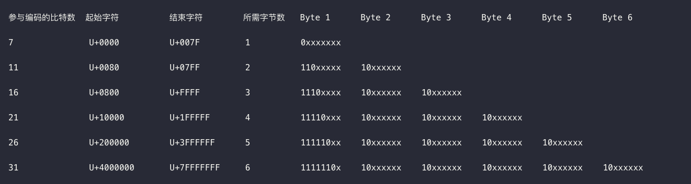

# 字符编码 

### 什么是字符编码
在一个晴朗的下午，你收到一封电子邮件，它来自一个你高中之后就失去联系的朋友，并带有一个txt格式（也称为纯文本格式）的附件。这个附件包含下面这样一串二进制bits：
```
0100100001000101010011000100110001001111
```
Email的正文是空的，这使它更加神秘。在你启动常用的文本编辑器打开这个附件之前，你有没有想过，文本编辑器是怎么将二进制形式翻译成字符的？
这其中有两个关键问题：
1. 字节是怎样分组的？（例如1个字节的字符和2个字节的字符）
2. 一个或多个字节是怎么映射到字符上的？

这些问题的答案就在这篇文档（Character Encoding）中，大致说来，编码定义了两件事：
1. 字节是怎么分组的，如8 bits或16 bits一组，这也被称作编码单元。
2. 编码单元和字符之间的映射关系。例如，在ASCII码中，十进制65映射到字母A上
### 字符集
#### ASCII
ASCII 使用 7 个比特，定义了 0-127 号字符。我们知道，一个字节有 8 个比特，因此有一个比特是没有被使用的。ASCII其实既是字符集也是字符编码方案，因为它太简单了，只需要一个字节就搞定了，根本不需要所谓的编码方案。
#### Unicode
Unicode 是一个字符集，定义了世界上所有字符的序号，具体来说，就是定义了字符与数字之间的映射关系，这个数字可以一直往上加，没有上限。它并没有规定字符在存储中应该如何表示，因此还需要一些编码方案来告诉存储如何存储和读取这些数字序号，比如UTF-8。
### 字符编码方案
#### UTF-8
UTF-8 是一个字符编码方案，基于 Unicode，主要是告诉存储应该如何存储和读取 Unicode 的数字序号。
具体编码方案如下图所示：

### Unicode 与 UTF-8
Unicode 与 UTF-8 之间到底是什么关系，其实也等于在问，字符集与编码方案之间是什么关系，我们来举个例子。
我们来算一下中文"你"的 UTF-8 编码应该是多少，步骤如下：
1. 首先我们查找 Unicode 码表，找到"你"的 Unicode 序号为 0X4F60
2. 对照 UTF-8 编码方案表，我们知道该序号在[0X0800, 0XFFFF] 区间，因此需要 3 个字节用来编码，并且也知道了它的编码规则。
3. 将0X4F60改写为二进制 0100 1111 0110 0000
4. 根据 UTF-8 的编码规则处理第3 步得到的二进制结果
5. 得到结果 1110 0100 1011 1101 1010 0000

可以看出，UTF-8 基于 Unicode，将 Unicode 序号经过一定的处理再交给存储。
### 参考
[学点编码知识又不会死](https://www.freebuf.com/articles/web/25623.html)  
[从字节理解 Unicode](https://www.cnblogs.com/zizifn/p/4716712.html)
