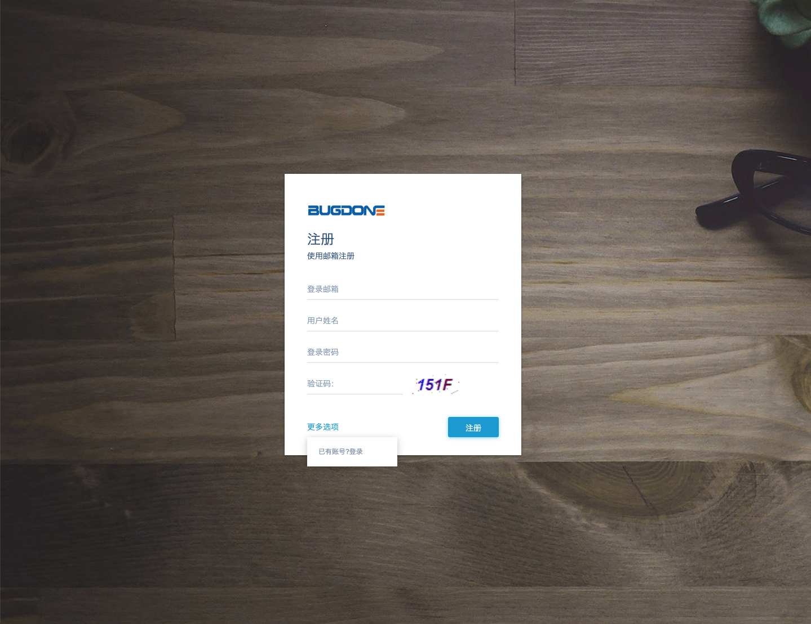
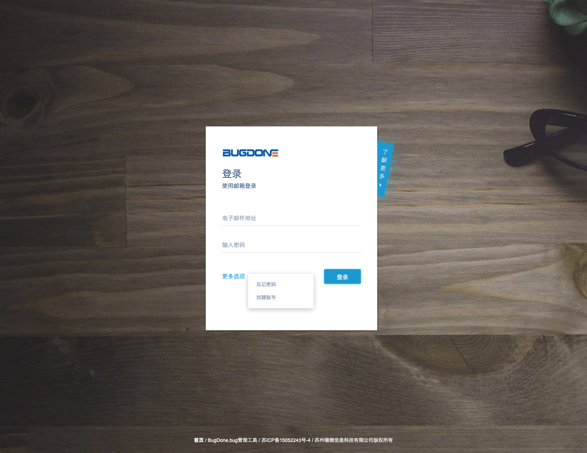
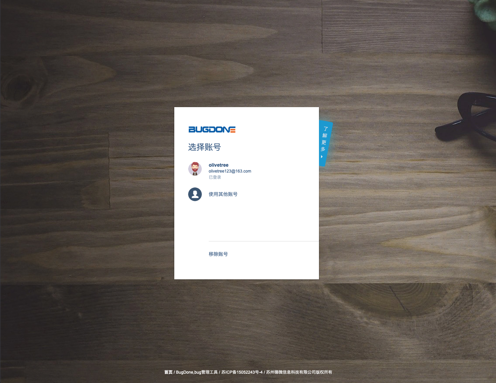
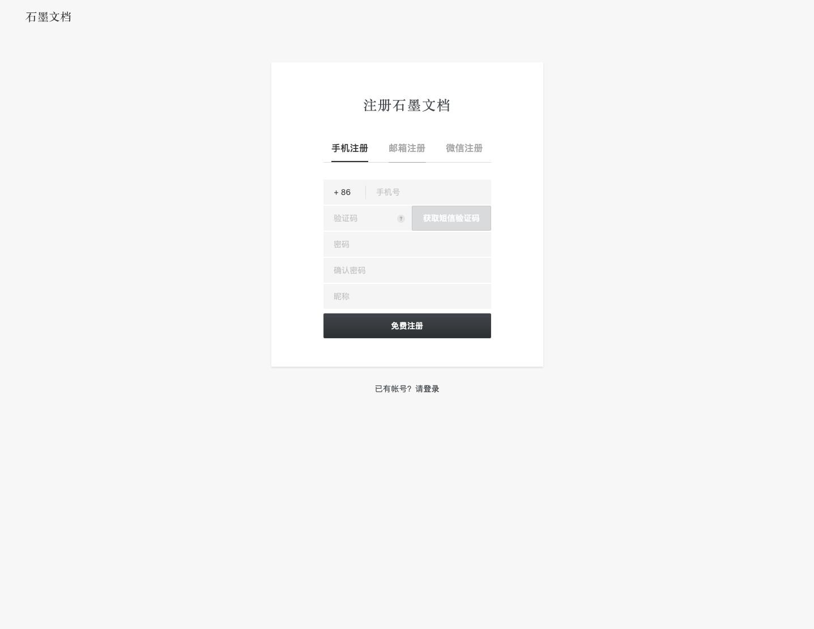
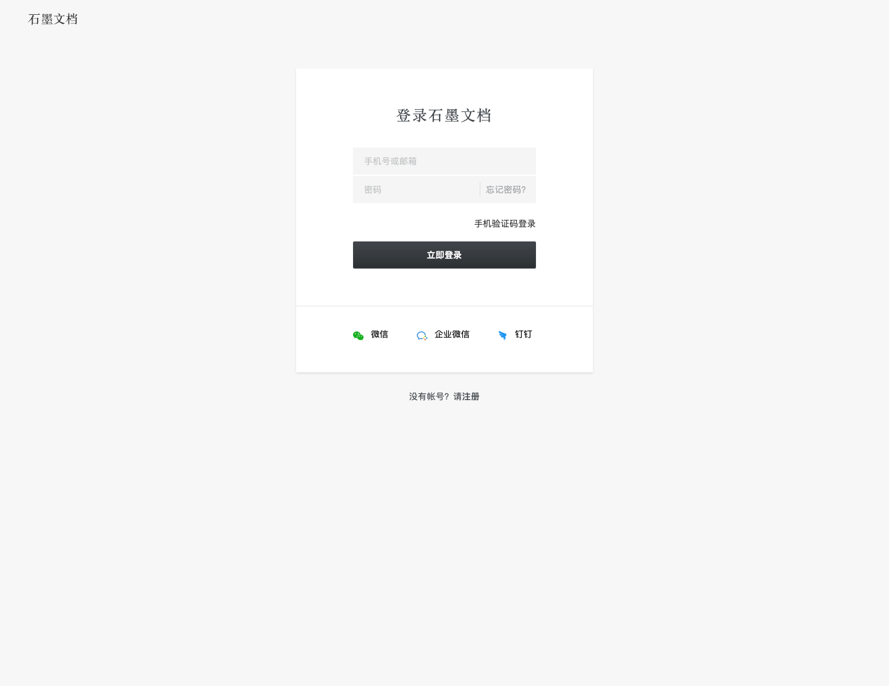
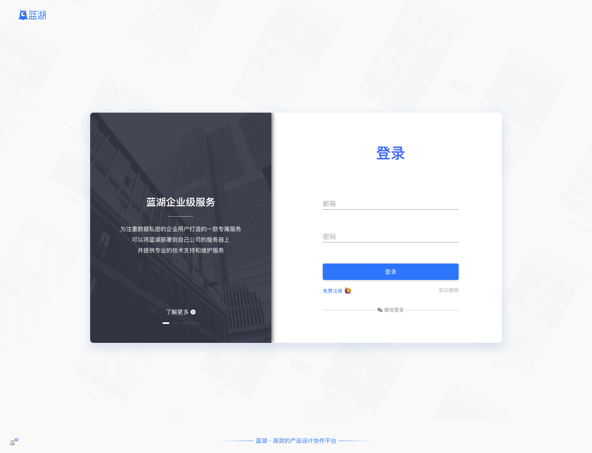
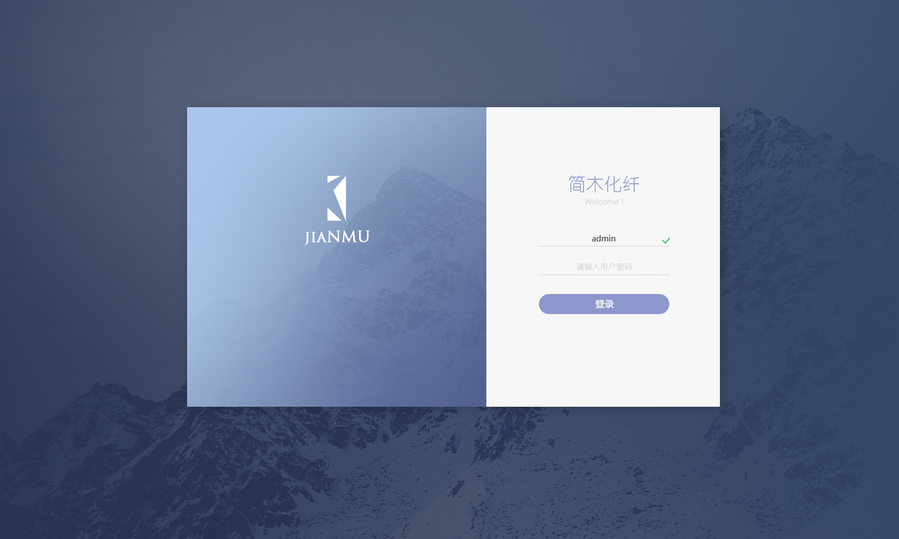
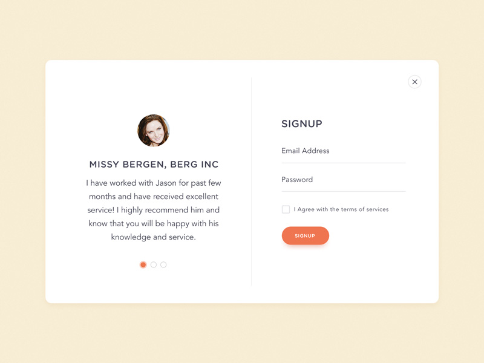
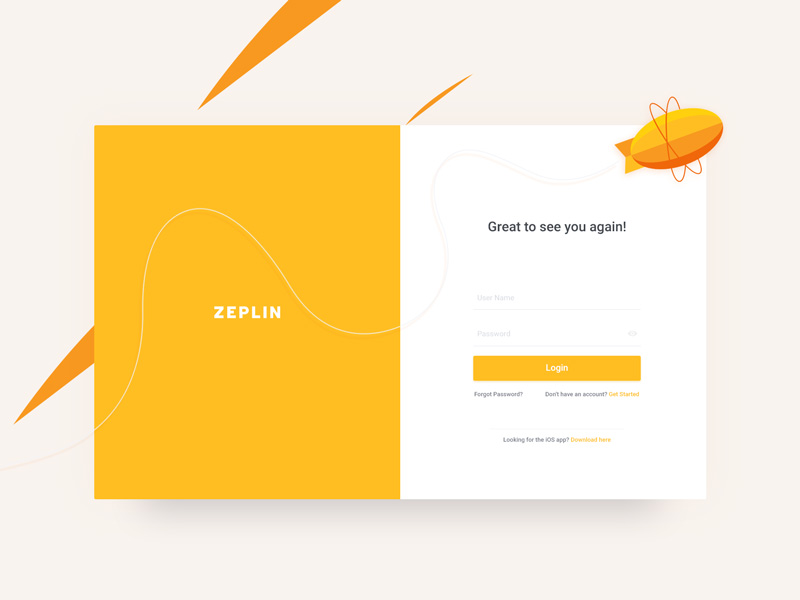
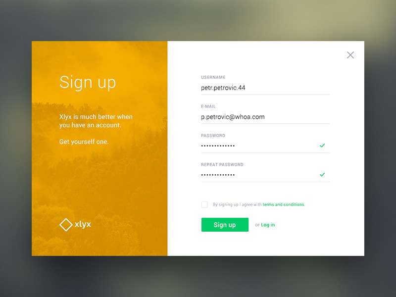

# 注册和登陆

## [bugdone](https://www.bugdone.cn)

一个字，好看！
## [石墨文档](https://shimo.im/login)

## [蓝湖](https://lanhuapp.com/web/#/user/login)

微信登陆的按钮比较有特色，谈不上好看，但是感觉很整齐。
很多登陆界面都是这种左右格式，确实好看，但是左边的信息真的有人看吗？到了这个页面，一般都会把注意力集中在账号密码上面吧。左边还不如放点好看的图片，或者放一个大的 logo，让用户记住你的 logo。
## 其他素材

## 总结
总的来说，注册和登陆的页面大致分为两种风格，一种类似 bugdone，大的背景图片加上一个居中的登录框；另一种类似于蓝湖，也是大的背景图加上一个居中的登录框，只不过登录框是左右格式的，左边是一些介绍或图片，右边才是真正的登录框。